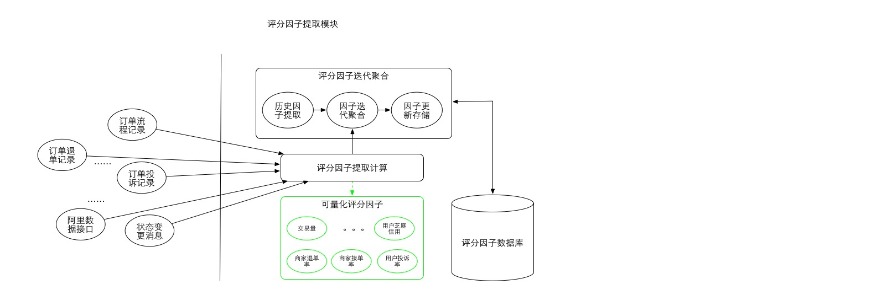

# 1.2 评分因子提取模块

* 评分因子提取详细流程

* 流程描述
  1. 各数据源数据抽取和数据量化
    
    目前来看，原始数据源主要是一些状态变更记录，也包含一些已经量化的基础值。获取方式主要有查表，消息监听，接口调取。这一系列数据并没有统一格式且并非完全标量化。各数据源抽取主要解决数据获取问题。它封装复杂的获取逻辑，为上层提供标量化数据。
  2. 新数据迭代更新

    数据迭代更新主要是将新的已经标量化的数据和历史标量数据合并，由于数据更新的场景基本是新数据比之前环境